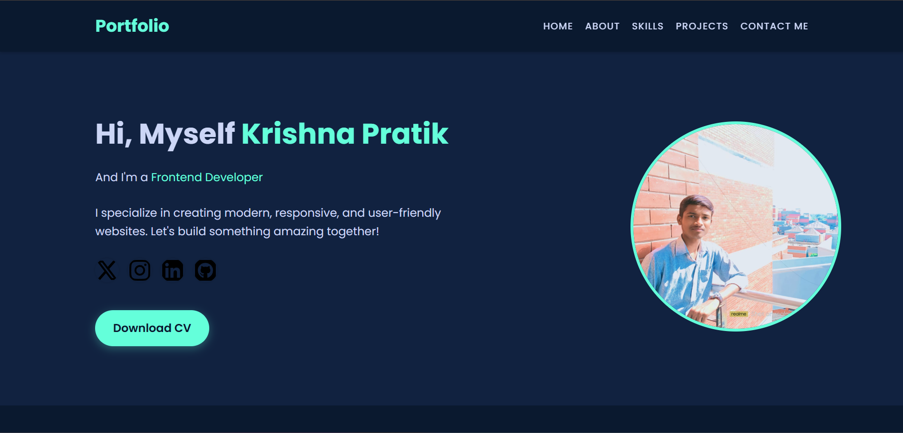

# 🚀 Krishna Pratik's Portfolio Website

Welcome to my **Personal Portfolio Website**!  
This site is a showcase of my skills, projects, and passion for web development. Designed with a modern, responsive layout, it provides a seamless experience across all devices. Explore my journey, discover my work, and feel free to connect!

---

## 🌟 Live Demo

👉 [View Portfolio Website](https://krishna-pratik.github.io/Krishna-Pratik-Portfolio/)  

---

## 📸 Preview

  

---

## 📝 Table of Contents

- [About the Project](#about-the-project)
- [Features](#features)
- [Tech Stack](#tech-stack)
- [Sections Overview](#sections-overview)
- [Responsive Design](#responsive-design)
- [How to Use](#how-to-use)
- [Contact](#contact)
- [Contributing](#contributing)
- [License](#license)

---

## 📖 About the Project

This portfolio website is a reflection of my journey as a **Frontend Developer**. It highlights my technical skills, showcases my best projects, and provides an easy way for visitors to get in touch. The site is built with clean, maintainable code and a focus on user experience.

---

## ✨ Features

- **Modern Hero Section**: Eye-catching introduction with social links and a downloadable CV.
- **About Me**: Brief background, education, and interests.
- **Skills**: Visual representation of my technical stack.
- **Projects**: Interactive cards with live demos and GitHub links for each project.
- **Contact Form**: Secure, spam-protected contact form powered by [FormSubmit](https://formsubmit.co/).
- **Responsive Design**: Fully optimized for mobile, tablet, and desktop.
- **Smooth Animations**: Subtle transitions and hover effects for an engaging experience.
- **Accessible**: Semantic HTML and accessible color contrasts.

---

## 🛠️ Tech Stack

- **HTML5**
- **CSS3** (Flexbox & Grid, Custom Animations)
- **JavaScript** (for interactivity, if used)
- **FormSubmit** (for contact form handling)

---

## 🗂️ Sections Overview

### 1. Hero Section
- Name, professional title, and a brief tagline.
- Social media icons (X/Twitter, Instagram, LinkedIn, GitHub) with hover effects.
- "Download CV" button for instant resume access.
- Profile image with a glowing border.

### 2. About Me
- Introduction, education, and a summary of my web development journey.
- Focus on frontend skills and growing backend expertise.

### 3. Skills
- Grid or flex layout of technology icons (HTML, CSS, JavaScript, etc.).

### 4. Projects
- Each project card includes:
  - Project image/thumbnail.
  - Title and concise description.
  - "Live Demo" button (opens project in a new tab).
  - GitHub button (links to source code).
- Projects are responsive and interactive.

### 5. Contact
- Simple, user-friendly contact form.
- Fields: Name, Email, Mobile, Subject, Message.
- Submissions handled securely via FormSubmit.

---

## 📱 Responsive Design

- Uses CSS Flexbox and Grid for adaptive layouts.
- Media queries ensure optimal viewing on all devices.
- Images and text scale gracefully for mobile, tablet, and desktop.

---

## 🚀 How to Use

1. **Clone the Repository**
   ```bash
   git clone https://github.com/Krishna-Pratik/Portfolio_Website.git
   cd Portfolio_Website
   ```

2. **Open in Your Browser**
   - Open `index.html` directly in your preferred browser.

3. **Customize**
   - Update content in `index.html` and images in the `images/` folder.
   - Replace the FormSubmit email in the contact form with your own.
   - Add or update project details as needed.

4. **Deploy**
   - Deploy to [GitHub Pages](https://pages.github.com/), [Vercel](https://vercel.com/), [Netlify](https://www.netlify.com/), or your preferred hosting platform.

---

## 📬 Contact

Feel free to reach out via the contact form on the website or connect with me on social media:

- [LinkedIn](https://www.linkedin.com/in/krishna-pratik/)
- [GitHub](https://github.com/Krishna-Pratik)
- [X (Twitter)](https://x.com/KrishnaPratik26)
- [Instagram](https://www.instagram.com/krishnapratik26/?hl=en)

---

## 🤝 Contributing

Contributions, suggestions, and feedback are welcome!  
If you'd like to contribute, please fork the repository, create a new branch, and submit a pull request.  
For major changes, please open an issue first to discuss what you would like to change.

---

## 📄 License

This project is **not open source**.  
All rights reserved by Krishna Pratik.  
See the LICENSE file for details.

---

> **Thank you for visiting my portfolio!**  
> *Let's build something amazing together!*

